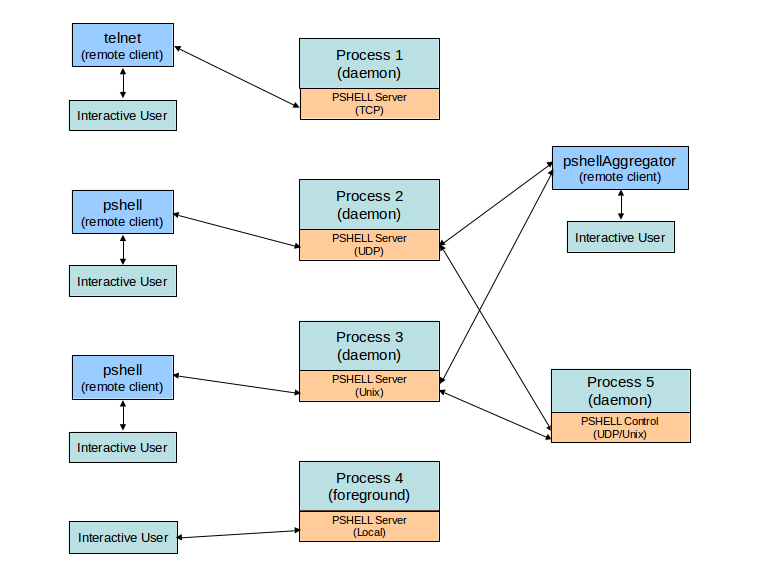

# pshell
**A Lightweight, Process-Specific, Embedded Command Line Shell/CLI for C/C++/Python/Go Applications**

[Overview](#overview)<br>
[Getting started](#getting-started)<br>
[Installation](#installation)<br>
[Building](#building)<br>
[Documentation](#documentation)<br>
[Interactive clients](#interactive-clients)<br>
&nbsp;&nbsp;&nbsp;&nbsp;[UDP/Unix (datagram) clients](#datagram-clients)<br>
&nbsp;&nbsp;&nbsp;&nbsp;&nbsp;&nbsp;&nbsp;&nbsp;[pshell UDP/Unix client](#pshell-client)<br>
&nbsp;&nbsp;&nbsp;&nbsp;&nbsp;&nbsp;&nbsp;&nbsp;[pshellAggregator UDP/Unix client](#pshellAggregator-client)<br>
&nbsp;&nbsp;&nbsp;&nbsp;[TCP clients](#tcp-clients)<br>
[Security](#security)<br>
[Demo programs](#demo-programs)<br>
&nbsp;&nbsp;&nbsp;&nbsp;[pshellServerDemo](#pshellServerDemo)<br>
&nbsp;&nbsp;&nbsp;&nbsp;[traceFilterDemo](#traceFilterDemo)<br>
&nbsp;&nbsp;&nbsp;&nbsp;[traceLogDemo](#traceLogDemo)<br>
&nbsp;&nbsp;&nbsp;&nbsp;[pshellControlDemo](#pshellControlDemo)<br>
&nbsp;&nbsp;&nbsp;&nbsp;[pshellNoServerDemo](#pshellNoServerDemo)<br>
&nbsp;&nbsp;&nbsp;&nbsp;[pshellAggregatorDemo](#pshellAggregatorDemo)<br>
&nbsp;&nbsp;&nbsp;&nbsp;[pshellReadlineDemo](#pshellReadlineDemo)<br>

<a name="overview"></a>
### Overview
This package contains all the necessary code, documentation and examples for
building C/C++/Python/Go applications that incorporate a Process Specific Embedded
Command Line Shell (PSHELL).  PSHELL is a multi-language, [cross platform](#building) framework
that provides a simple mechanism to embed interactive functions/commands within any
C/C++/Python/Go application.  Those functions can be invoked interactively either via
a separate remote client program, directly from within the application itself, or
externally from another process via the control API.

The Python, C, and Go versions are consistent with each other at the API level (i.e.
similar functional API, usage, process interaction etc) and fully interoperable with each
other at the protocol level and can be mixed and matched in any combination.

The functions/commands are registered as callback functions to the framework.  The
prototype for the callback functions follow the paradigms of the `main` for each language.
Pshell callback functions can be thought of as a collection of mini `mains` within the
given process that are invoked via their registered keywords.  The arguments are passed
into each function just like they would be passed into the `main` from the host's native
command line shell (i.e. bash) for each language as shown below.  See the included
[demo programs](#demo-programs) for language specific examples.

#### C callback:

`void myFunc(int argc, char *argv[])`

#### Python callback:

`def myFunc(argv)`

#### Go callback:

`func myFunc(argv []string)`

Pshell functions can also display information back to the interactive clients via a
mechanism similar to the familiar 'printf' as follows:

#### C printf:

`void pshell_printf(const char *format, ...)`

#### Python printf:

`def printf(string)`

#### Go printf:

`func Printf(format string, message ...interface{})`

These functions can be invoked via several methods depending on how the internal PSHELL
server is configured.  The following shows the various PSHELL server types along with their
associated invokation method:

* TCP Server   : Uses standard `telnet` interactive client to invoke functions
* UDP Server   : Uses included `pshell/pshellAggregator` interactive clients or control API to invoke functions
* UNIX Server  : Uses included `pshell/pshellAggregator` interactive clients or control API to invoke functions
* LOCAL Server : No client program needed, functions invoked directly from within application
                 itself via local command line interactive prompting

The functions are dispatched via its registered command name (keyword), along with 0 or more
command line arguments, similar to command line shell processing.

There is also a control API provided by where any external program can invoke another
program's registered pshell functions (only supported for UDP or UNIX pshell servers).
This will provide direct programmatic control of a remote process' pshell functions
without having to fork the calling process to call the `pshell` command line client
program via the `system` call.  This provides functionality similar to the familiar
Remote Procedure Call (RPC) mechanism.

The control API can function as a simple control plane IPC mechanism for inter-process
communication and control.  If all inter-process control is implemented as a collection
of pshell commands, a user can get a programmatic IPC mechanism along with manual CLI/Shell
access via the same code base.  There is no need to write separate code for CLI/Shell
processing and control/message event processing.  All inter-process control can then be
driven and tested manually via one of the [interactive client](#interactive-clients) programs
([pshell](#pshell-client) or [pshellAggregator](#pshellAggregator-client)).

The control API supports both unicast and 'multicast' (not true subscriber based multicast
like IGMP, it's more like sender based aggregated unicast)  messaging paradigms.  It also
supports messaging to broadcast pshell servers (i.e. UDP server running at a subnet
broadcast address, e.g. x.y.z.255).

The following block diagram shows the various server types along with their associated
remote client access methods.



See the full [README](https://github.com/RonIovine/pshell/blob/master/README) file for a complete description
of all the components, installation, building, and usage.

Note, this package was originally hosted at [code.google.com](https://code.google.com) as
[RDB-Lite](https://code.google.com/p/rdb-lite), it was re-christened as 'pshell' when it was
migrated to this hosting service.

<a name="getting-started"></a>
### Getting started
The following sections describe an overview of getting started with the basic features of the framework.

<a name="installation"></a>
### Installation
All of the included binaries should work for most modern x86_64 based Linux systems as-is.  They have
been tested on Mint, Ubuntu, and CentOS.  To install, there is an `install.sh` script provided.  To see
the usage of the install script, from the top level pshell directory run:
```
$ ./install.sh -h

Usage: install.sh [-local [<shellEnvFile>]]

  This install script will either install this package on a system
  wide basis or will setup a local install environment.  A system
  install must be done as 'root' and will copy all libraries, binaries,
  include files, conf files, and manpages to their customary system
  locations.  A local install will not copy/move any files.  It will
  only create a pshell env file (.pshellrc) that can be sourced in the
  current shell or can be added to your shell env file (i.e. .bashrc)
  that will allow use of the package features from a local directory.

  The location of the local install environment will be the directory
  where this script resides.

  where:
    local        - install locally, omit for system install
    shellEnvFile - name of shell environment file to modify
                   (e.g. full path to your .bashrc)
```
The simplest install is a local install, from the top level pshell directory run:

`$ ./install.sh -local`

This will create an environment file, `.pshellrc` that should be sourced in your system's local command
line shell (e.g. `bash`), it should also be sourced in your host's shell env file, i.e. `.bashrc`.  This
will setup several softlinks and environment variables that will allow access to the various parts of the
framework.

<a name="building"></a>
### Building
For targets other than Linux x86_64, the C and Go code will need to be built from source.  This
framework has been successfully built and run on Raspbian/Kali ARM Linux, MAC OSX, and Windows Cygwin.
To build the C and Go source, a makefile is provided along with a default make config file, `defconfig`.

To see the make options, type:

```
$ make

Usage: make {all | client | lib | demo | install | clean} [verbose=y] [local=y [shellEnvFile=<file>]]

  where:
    all          - build all components of the pshell package
    client       - build the pshell UDP/UNIX stand-alone client programs only
    lib          - build the pshell link libraries only (shared, static and stub)
    demo         - build the pshell stand-alone demo programs only
    install      - build and install all pshell components
    clean        - clean all binaries (libs & executables)
    verbose      - print verbose messages from build process
    local        - specify local install (install target only)
    shellEnvFile - shell env file (i.e. .bashrc) to modify for local install

  NOTE: The install target option will either install this package on a
        system wide basis or will setup a local install environment.  A system
        install must be done as 'root' and will copy all libraries, binaries,
        include files, conf files, and manpages to their customary system
        locations.  A local install will not copy/move any files.  It will
        only create a pshell env file (.pshellrc) that can be sourced in the
        current shell or can be added to your shell env file (i.e. .bashrc)
        that will allow use of the package features from a local directory.

        The location of the local install environment will be the directory
        where this script resides.
```
To do a make and local install, run:

`$ make install local=y`

This will compile all the C and Go code and run the above `install.sh` script for a local install.
Note, to build the C code, you must have the `g++` compiler installed on your host, to build the Go
code, you must have the `go` compiler installed on your host.

<a name="documentation"></a>
### Documentation
See the PPT presentation [PSHELL-Framework.ppt](https://github.com/RonIovine/pshell/blob/master/PSHELL-Framework.ppt) at the top level directory for an overview of the main
features and capabilities of the framework.

There is also documentation for the C API in the form of manpages in the [c/man](https://github.com/RonIovine/pshell/tree/master/c/man) directory.
The following manpages are provided:

[pshell(1)](https://github.com/RonIovine/pshell/tree/master/c/man/man1/pshell.1)<br>
[pshellAggregator(1)](https://github.com/RonIovine/pshell/tree/master/c/man/man1/pshellAggregator.1)<br>
[PshellServer(3)](https://github.com/RonIovine/pshell/tree/master/c/man/man3/PshellServer.3)<br>
[PshellControl(3)](https://github.com/RonIovine/pshell/tree/master/c/man/man3/PshellControl.3)<br>
[PshellReadline(3)](https://github.com/RonIovine/pshell/tree/master/c/man/man3/PshellReadline.3)<br>
[TraceFilter(3)](https://github.com/RonIovine/pshell/tree/master/c/man/man3/TraceFilter.3)<br>
[TraceLog(3)](https://github.com/RonIovine/pshell/tree/master/c/man/man3/TraceLog.3)<br>

The following HTML 'pydoc' generated documentation is available in the
[python/doc](https://github.com/RonIovine/pshell/tree/master/python/doc) directory, the user can also use the command line 'pydoc' to
see the embedded documentation on all the corresponding python modules.

[pshell.html](https://github.com/RonIovine/pshell/tree/master/python/doc/pshell.html)<br>
[pshellAggregator.html](https://github.com/RonIovine/pshell/tree/master/python/doc/pshell.html)<br>
[PshellServer.html](https://github.com/RonIovine/pshell/tree/master/python/doc/pshellAggregator.html)<br>
[PshellControl.html](https://github.com/RonIovine/pshell/tree/master/python/doc/PshellControl.html)<br>
[PshellReadline.html](https://github.com/RonIovine/pshell/tree/master/python/doc/PshellReadline.html)<br>
[TraceLog.html](https://github.com/RonIovine/pshell/tree/master/python/doc/TraceLog.html)<br>

The following HTML 'godoc' generated documentation is available in the
[go/doc](https://github.com/RonIovine/pshell/tree/master/go/doc) directory, the user can also use the command line 'godoc' to see
the embedded documentation on all the corresponding Go modules.

[PshellServer.html](https://github.com/RonIovine/pshell/tree/master/go/doc/PshellServer.html)<br>
[PshellControl.html](https://github.com/RonIovine/pshell/tree/master/go/doc/PshellControl.html)<br>

<a name="interactive-clients"></a>
### Interactive clients
As described above, a pshell server can be accessed remotely via an interactive client.  These clients are
generic and are server agnostic.  A custom client never needs to be created unless the user want's to
create a custom server aggregator client.  See the below section for the [pshellAggregatorDemo](#pshellAggregatorDemo) demo programs
for more information on creating custom aggregators.

<a name="datagram-clients"></a>
#### UDP/Unix (datagram) clients
The UDP/Unix based servers use one of the datagram clients for interactivce access.  There is a client
for access to a single datagram server called `pshell`, and a client for access to multiple datagram
servers called `pshellAggregator`.  The datagram based servers support multiple client sessions with
no idle session timeout.

There are 2 versions of each datagram client program, [pshell](https://github.com/RonIovine/pshell/tree/master/c/src/PshellClient.cc)/[pshellAggregator](https://github.com/RonIovine/pshell/tree/master/c/src/PshellAggregator.cc), which are compiled 'C' implementations,
and [pshell.py](https://github.com/RonIovine/pshell/tree/master/python/src/pshell.py)/[pshellAggregator.py](https://github.com/RonIovine/pshell/tree/master/python/src/pshellAggregator.py), which are Python implementations.  Any of those can interface to any of the
[pshellServerDemo](#pshellServerDemo) programs for all 3 languages as well as the [traceFilterDemo](#traceFilterDemo) program

<a name="pshell-client"></a>
##### pshell UDP/Unix client
The pshell client programs are used to access a specific datagram pshell server.  Both the compiled
'C' version ([pshell](https://github.com/RonIovine/pshell/tree/master/c/src/PshellClient.cc)) and Python version ([pshell.py](https://github.com/RonIovine/pshell/tree/master/python/src/pshell.py)) have the same usage as follows:
```
$ pshell -h

Usage: pshell -s | -n | {{{<hostName | ipAddr>} {<portNum> | <udpServerName>}} | <unixServerName> | <serverIndex} [-t<timeout>]
                        [{{-c <command> | -f <filename>} [rate=<seconds>] [repeat=<count>] [clear]}]

  where:
    -s              - show all servers running on the local host
    -n              - show named IP server/port mappings in pshell-client.conf file
    -c              - run command from command line
    -f              - run commands from a batch file
    -t              - change the default server response timeout
    hostName        - hostname of UDP server
    ipAddr          - IP addr of UDP server
    portNum         - port number of UDP server
    udpServerName   - name of UDP server from pshell-client.conf file
    unixServerName  - name of UNIX server (use '-s' option to list servers)
    serverIndex     - index of local UNIX or UDP server (use '-s' option to list servers)
    timeout         - response wait timeout in sec (default=5)
    command         - optional command to execute (in double quotes, ex. -c "myCommand arg1 arg2")
    fileName        - optional batch file to execute
    rate            - optional rate to repeat command or batch file (in seconds)
    repeat          - optional repeat count for command or batch file (default=forever)
    clear           - optional clear screen between commands or batch file passes

    NOTE: If no <command> is given, pshell will be started
          up in interactive mode, commands issued in command
          line mode that require arguments must be enclosed
          in double quotes, commands issued in interactive
          mode that require arguments do not require double
          quotes.

          To get help on a command in command line mode, type
          "<command> ?" or "<command> -h".  To get help in
          interactive mode type 'help' or '?' at the prompt to
          see all available commands, to get help on a single
          command, type '<command> {? | -h}'.  Use TAB completion
          to fill out partial commands and up-arrow to recall
          for command history.
```

<a name="pshellAggregator-client"></a>
##### pshellAggregator UDP/Unix client
The pshellAggregator client programs are used to access multiple datagram pshell servers.  This is
useful to consolidate the functionality of several pshell servers into one comprehensive interactive
user session.  This is the generic aggregator client that can be used to aggregate any datagram based
pshell server.  This is different than the custom aggregator ([pshellAggregatorDemo](#pshellAggregatorDemo))
that typically will only aggregate specific hardcoded pshell servers.  Both the compiled 'C' version
([pshellAggregator](https://github.com/RonIovine/pshell/tree/master/c/src/PshellAggregator.cc)) and Python version ([pshellAggregator.py](https://github.com/RonIovine/pshell/tree/master/python/src/pshellAggregator.py)) have the same usage as follows:
```
$ pshellAggregator -h

Usage: pshellAggregator

  Client program that will allow for the aggregation of multiple remote
  UDP/UNIX pshell servers into one consolidated client shell.  This program
  can also create multicast groups for sets of remote servers.  The remote
  servers and multicast groups can be added interactively via the 'add'
  command or at startup via the 'pshellAggregator.startup' file.
```

<a name="tcp-clients"></a>
#### TCP clients
The TCP based servers just use a standard `telnet` client for interactive access.  The TCP based
servers support only a single client session with a default 10 minute idle session timeout/disconnect.

There is also an `expect` wrapper script, [pshell.exp](https://github.com/RonIovine/pshell/tree/master/utils/pshell.exp), that will wrap `telnet` to provide functionality
similar to the above `pshell` datagram clients for things like command mode single-shot commands, file
based commands, command/file repeat etc but for TCP based pshell servers.  The `expect` scripting package
must be installed on your host.  The following is the usage of the expect script.
```
$ pshell.exp -h

Usage: pshell.exp -n | {<hostName> | ipAddr>} {<portNum> | <serverName>}
                       [{{-c <command> | -f <filename>} [rate=<seconds>] [repeat=<count>] [clear]}]

  where:
    -n         - show named IP server/port mappings in pshell-client.conf file
    -c         - run command from command line
    -f         - run commands from a batch file
    hostName   - hostname of TCP server
    ipAddr     - IP address of TCP server
    portNum    - port number of TCP server
    serverName - name of TCP server from pshell-client.conf file
    command    - optional command to execute (in double quotes, ex. -c "myCommand arg1 arg2")
    fileName   - optional batch file to execute
    rate       - optional rate to repeat command or batch file (in seconds)
    repeat     - optional repeat count for command or batch file (default=forever)
    clear      - optional clear screen between commands or batch file passes

    NOTE: If no <command> is given, pshell will be started
          up in interactive mode, commands issued in command
          line mode that require arguments must be enclosed
          in double quotes, commands issued in interactive
          mode that require arguments do not require double
          quotes.

          To get help on a command in command line mode, type
          "<command> ?" or "<command> -h".  To get help in
          interactive mode type 'help' or '?' at the prompt to
          see all available commands, to get help on a single
          command, type '<command> {? | -h}'.  Use TAB completion
          to fill out partial commands and up-arrow to recall
          the last entered command.

    NOTE: If the default terminal title bar and/or prompt are changed
          in the PshellServers.c file, the variables 'title' and 'prompt'
          at the top of this script must be changed accordingly, however,
          if the default terminal title bar and/or prompt are changed in
          the pshell-server.conf file AND we are calling this script with
          a serverName as opposed to a portNum, this script will automatically
          detect that and assign the new values

```

<a name="security"></a>
### Security
This framework was created to provide a debug/diagnostics interface for developers,
testers, manufacturing, field support etc, it was not conceived as an end-user/customer-facing
UI.  It provides for remote interaction and control of a process running the PshellServer
framework via an IP based client/server paradigm.  The pshell protocol used to communicate
between the client and server is an unencrypted plain text protocol.  As such, if security is
an issue, it should be treated as any other unsecure protocol, such as telnet.  The local
target's PshellServer IP address and port should only be exposed within a trusted local network
or secure VPN, but should not be exposed for general use over untrusted networks, such as the
public Internet.  For maximum security between the client and server, the server can be run
either as a UNIX domain server or at the target host's local loopback address (i.e. 127.0.0.1)
and the PSHELL client applications (pshell, pshellAggregator, telnet) can be installed to run
on the same local host as the target application.  Of course, a secure mechanism (like ssh or
direct serial console) would then need to be used to provide a secure user access method to
that host.

For complete security a stub library/modules are provided that honor the complete
PshellServer API but with the underlying functionality stubbed out.  The build/packaging
system for the target applications can be setup such that for a development build, the
fully functional PshellServer libraries/modules are utilized, but for a final release build
the stub versions are used.  However one note of caution to be considered in this regard
is if the PshellControl API is used as a control plane IPC, building/packaging with the
stub versions of the PshellServer will render the control plane inoperable.

<a name="demo-programs"></a>
### Demo programs
There are several demo programs that provide examples of using the various aspects of the framework.  Each
language specific directory has a 'demo' subdirectory.  Look at the language specific examples for your
language of interest for [C](https://github.com/RonIovine/pshell/tree/master/c/demo), [Python](https://github.com/RonIovine/pshell/tree/master/python/demo), and [Go](https://github.com/RonIovine/pshell/tree/master/go/src).

The following sections describes all the demo programs in order of importance/relevance.  Click on the
language of interest for each example to see specific implementations.

<a name="pshellServerDemo"></a>
#### 1. pshellServerDemo ([C](https://github.com/RonIovine/pshell/blob/master/c/demo/pshellServerDemo.cc), [Python](https://github.com/RonIovine/pshell/blob/master/python/demo/pshellServerDemo.py), and [Go](https://github.com/RonIovine/pshell/blob/master/go/src/pshellServerDemo/pshellServerDemo.go))
This is the most important demo program.  It shows how to setup a pshell server to run within any process.
It has example implementations of pshell callback functions, the registration of those functions within
the framework, and the starting of the pshell server.  This is all that is needed to add interactive pshell
access to a given process.  From your shell command line, invoke any of the `pshellServerDemo` programs with
the `-h` option to see the usage.  All language implementations are fully compatible with all different
clients.  Note that in these demo implementations, the servers are setup at the end of the `main` in BLOCKING
mode.  When retro-fitting an existing application that already has a final control loop in the `main` to keep
the process resident, the server will most likely be setup at the beginning of the `main`, before the final
control loop and in NON_BLOCKING mode.  See the [traceFilterDemo.cc](https://github.com/RonIovine/pshell/blob/master/c/demo/traceFilterDemo.cc) program for an example of this.

```
$ pshellServerDemo -h

Usage: pshellServerDemo -udp [<port>] | -tcp [<port>] | -unix | -local

  where:
    -udp   - Multi-session UDP server
    -tcp   - Single session TCP server
    -unix  - Multi-session UNIX domain server
    -local - Local command dispatching server
    <port> - Desired UDP or TCP port, default: 6001
```
Then invoke the program in the foreground with the desired server type.  For a good example, run
the program in 4 different windows, each using a different server type option as follows:
```
$ pshellServerDemo -tcp
PSHELL_INFO: TCP Server: pshellServerDemo Started On Host: anyhost, Port: 6001
```
```
$ pshellServerDemo -udp
PSHELL_INFO: UDP Server: pshellServerDemo Started On Host: anyhost, Port: 6001
```
```
$ pshellServerDemo -unix
PSHELL_INFO: UNIX Server: pshellServerDemo Started
```
To connect to the TCP server type:
```
$ telnet localhost 6001
Trying 127.0.0.1...
Connected to localhost.
Escape character is '^]'.

################################################################
#
#  PSHELL: Process Specific Embedded Command Line Shell
#
#  Single session TCP server: pshellServerDemo[127.0.0.1:6001]
#
#  Idle session timeout: 10 minutes
#
#  To show command elapsed execution time, use -t <command>
#
#  Type '?' or 'help' at prompt for command summary
#  Type '?' or '-h' after command for command usage
#
#  Full <TAB> completion, command history, command
#  line editing, and command abbreviation supported
#
################################################################

pshellServerDemo[127.0.0.1:6001]:PSHELL>
```
To connect to the UDP server type:
```
$ pshell localhost 6001

###############################################################
#
#  PSHELL: Process Specific Embedded Command Line Shell
#
#  Multi-session UDP server: pshellServerDemo[127.0.0.1:6001]
#
#  Idle session timeout: NONE
#
#  Command response timeout: 5 seconds
#
#  The default response timeout can be changed on a
#  per-command basis by preceeding the command with
#  option -t<timeout>
#
#  e.g. -t10 <command>
#
#  Use -t0 for no response, -t-1 to wait forever
#
#  The default timeout for all commands can be changed
#  by using the -t<timeout> option with no command, to
#  display the current default timeout, just use -t with
#  no command
#
#  To show command elapsed execution time, use -t <command>
#  Note, this will execute the command with a WAIT_FOREVER
#  command response timeout
#
#  Type '?' or 'help' at prompt for command summary
#  Type '?' or '-h' after command for command usage
#
#  Full <TAB> completion, command history, command
#  line editing, and command abbreviation supported
#
###############################################################

pshellServerDemo[127.0.0.1:6001]:PSHELL>
```
To connect to the Unix server type:
```
$ pshell pshellServerDemo

#########################################################
#
#  PSHELL: Process Specific Embedded Command Line Shell
#
#  Multi-session UNIX server: pshellServerDemo[unix]
#
#  Command response timeout: 5 seconds
#
#  The default response timeout can be changed on a
#  per-command basis by preceeding the command with
#  option -t<timeout>
#
#  e.g. -t10 <command>
#
#  Use -t0 for no response, -t-1 to wait forever
#
#  The default timeout for all commands can be changed
#  by using the -t<timeout> option with no command, to
#  display the current default timeout, just use -t with
#  no command
#
#  To show command elapsed execution time, use -t <command>
#  Note, this will execute the command with a WAIT_FOREVER
#  command response timeout
#
#  Type '?' or 'help' at prompt for command summary
#  Type '?' or '-h' after command for command usage
#
#  Full <TAB> completion, command history, command
#  line editing, and command abbreviation supported
#
#########################################################

pshellServerDemo[unix]:PSHELL>
```

A local server has no remote client.  All interactive control is done directly within the application itself.
```
$ pshellServerDemo -local

#########################################################
#
#  PSHELL: Process Specific Embedded Command Line Shell
#
#  Single session LOCAL server: pshellServerDemo[local]
#
#  Idle session timeout: NONE
#
#  To show command elapsed execution time, use -t <command>
#
#  Type '?' or 'help' at prompt for command summary
#  Type '?' or '-h' after command for command usage
#
#  Full <TAB> completion, command history, command
#  line editing, and command abbreviation supported
#
#########################################################

pshellServerDemo[local]:PSHELL>
```

<a name="traceFilterDemo"></a>
#### 2. traceFilterDemo ([C](https://github.com/RonIovine/pshell/blob/master/c/demo/traceFilterDemo.cc) only)
This is an application that shows a possible real world use case for the PSHELL framework.  It shows the integration
of a programmable trace filter mechanism with remote pshell server control.  It can be controlled by any of the [interactive clients](#interactive-clients)
depending on how it is started.  It uses the following example [trace log](#traceLogDemo) implementation for the log
formatting and output.  The following is the usage of this program:
```
$ traceFilterDemo -h

Usage: traceFilterDemo -udp [<port>] | -tcp [<port>] | -unix

  where:
    -udp   - Multi-session UDP server
    -tcp   - Single session TCP server
    -unix  - Multi-session UNIX domain server
    <port> - Desired UDP or TCP port, default: 6002
```


<a name="traceLogDemo"></a>
#### 3. traceLogDemo ([C](https://github.com/RonIovine/pshell/blob/master/c/demo/traceLogDemo.cc) and [Python](https://github.com/RonIovine/pshell/blob/master/python/demo/traceLogDemo.py))
This is an example of the trace logger without the extensive filtering capability as the [traceFilterDemo](#traceFilterDemo) example.  It has simple hierarichical levels that
can be controlled interactively via an integrated PSHELL server.  The following is the
usage of this program:
```
$ traceLogDemo -h

Usage: traceLogDemo <level> [custom]

  where:
    <level>  - The desired log level value, 0-10
    custom   - Use a custom log format
```

<a name="pshellControlDemo"></a>
#### 4. pshellControlDemo ([C](https://github.com/RonIovine/pshell/blob/master/c/demo/pshellControlDemo.cc), [Python](https://github.com/RonIovine/pshell/blob/master/python/demo/pshellControlDemo.py), and [Go](https://github.com/RonIovine/pshell/blob/master/go/src/pshellControlDemo/pshellControlDemo.go))
These demo programs show one process invoking pshell functions in another process using the control API.
This is the RPC-like IPC mechanism.  All 3 implementations take a `-h` to show the usage.  Any of them can
be used to connect to any of the previous [pshellServerDemo](#pshellServerDemo) or [traceFilterDemo](#traceFilterDemo) programs and invoke their functions.  The control demo programs will prompt the user
for input for the remote command to invoke, but in real process-to-process IPC situation, the IPC commands
used in the control API functions will most likely be built into the code.  The following is the usage of the
`pshellControlDemo` programs:
```
$ pshellControlDemo -h

Usage: pshellControlDemo {<hostname> | <ipAddress> | <unixServerName>} {<port> | unix}
                         [-t<timeout>] [-l<logLevel>] [-extract]

  where:
    <hostname>       - hostname of UDP server
    <ipAddress>      - IP address of UDP server
    <unixServerName> - name of UNIX server
    unix             - specifies a UNIX server
    <port>           - port number of UDP server
    <timeout>        - wait timeout for response in mSec (default=100)
    <logLevel>       - log level of control library (0-3, default=3, i.e. all)
    extract          - extract data contents of response (must have non-0 wait timeout)
```

<a name="pshellNoServerDemo"></a>
#### 5. pshellNoServerDemo ([C](https://github.com/RonIovine/pshell/blob/master/c/demo/pshellNoServerDemo.cc) only)
This is an implementation that allows the user to use this framework to create a multi-call binary
similar to [Busybox](https://www.busybox.net).  This is not really used to retro-fit existing applications,
but would be used when creating a new application by where there are multiple entry points that map
to individual pshell commands.  This does not use any external client and all functions are accessed
via the hosts command shell (i.e. bash) by directly invoking the application or by the optional softlinks
which map to each individual command.  The following is the usage of this program:
```
$ pshellNoServerDemo -h

****************************************
*             COMMAND LIST             *
****************************************

help             -  show all available commands
batch            -  run commands from a batch file
helloWorld       -  command that prints out arguments
wildcardMatch    -  command that does a wildcard matching
enhancedUsage    -  command with enhanced usage
formatChecking   -  command with arg format checking
advancedParsing  -  command with advanced command line parsing
getOptions       -  example of parsing command line options

To run command type 'pshellNoServerDemo <command>'

To get command usage type 'pshellNoServerDemo <command> {? | -h}'

The special command 'pshellNoServerDemo --setup' can be run
to automatically setup Busybox like softlink shortcuts for
each of the commands.  This will allow direct access to each
command from the command line shell without having to use the
actual parent program name.  This command must be run from the
same directory the parent program resides and may require root
privlidges depending on the directory settings.
```

<a name="pshellAggregatorDemo"></a>
#### 6. pshellAggregatorDemo ([C](https://github.com/RonIovine/pshell/blob/master/c/demo/pshellAggregatorDemo.cc) and [Python](https://github.com/RonIovine/pshell/blob/master/python/demo/pshellAggregatorDemo.py)) <a name="pshellAggregatorDemo"></a>
This shows an example UDP/Unix interactive client that can control several remote pshell servers in one
interactive session.  Note that this is different than the generic [pshellAggregator](#pshellAggregator-client)
client program described above in that this is a custom aggregator by where the servers being aggregated are
typically hardcoded.  This can be useful for creating a client that does not expose all the raw native server
commands, but rather might want to hide certain commands from individual servers and also create 'meta' commands
that consist of several discrete commands to several different servers.  The following is the usage of the program:
```
$ pshellAggregatorDemo -h

Usage: pshellAggregatorDemo {<hostname> | <ipAddress>} [<pshellServerDemoPort> <traceFilterDemoPort>]
```

<a name="pshellReadlineDemo"></a>
#### 7. pshellReadlineDemo ([C](https://github.com/RonIovine/pshell/blob/master/c/demo/pshellReadlineDemo.cc) and [Python](https://github.com/RonIovine/pshell/blob/master/python/demo/pshellReadlineDemo.py))
This is not really part of the pshell client/server paradigm per-se, but rather is just a handy
stand-alone readline like implementation that can be used by any application to solicit user input.
It will work with any raw serial character based I/O from either a TCP socket in telnet mode or over
a raw TTY serial port.  It has native command recall history, TAB completion, and command line editing
capability.  The following is the usage of this program:
```
$ pshellReadlineDemo -h

Usage: pshellReadlineDemo {-tty | -socket} [-bash | -fast] [<idleTimeout>]

  where:
    -tty          - serial terminal using stdin and stdout (default)
    -socket       - TCP socket terminal using telnet client
    -bash         - Use bash/readline style tabbing
    -fast         - Use "fast" style tabbing (default)
    <idleTimeout> - the idle session timeout in minutes (default=none)
```
